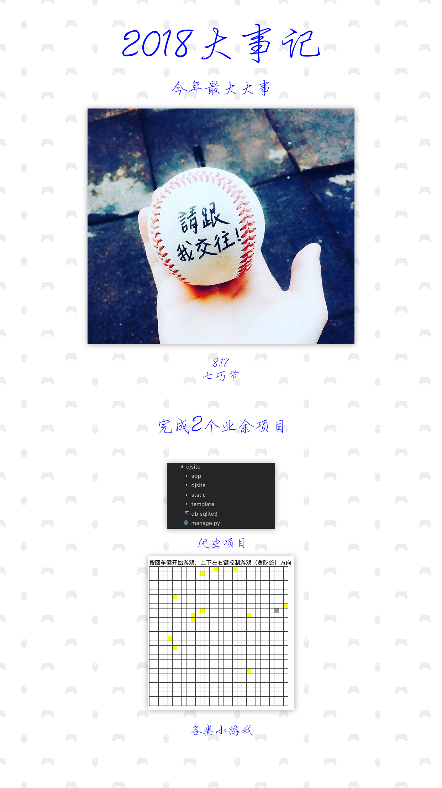
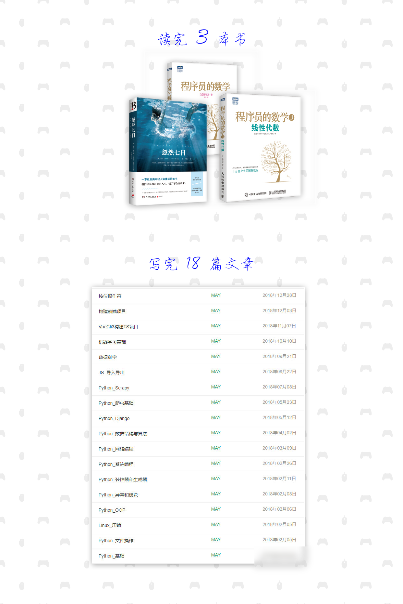
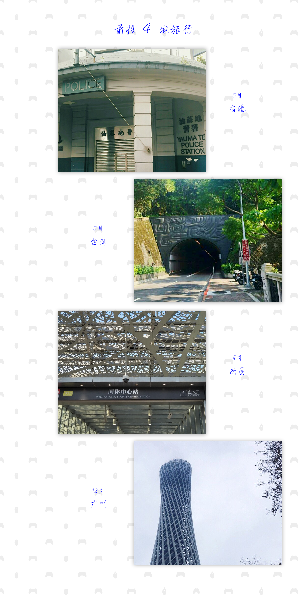
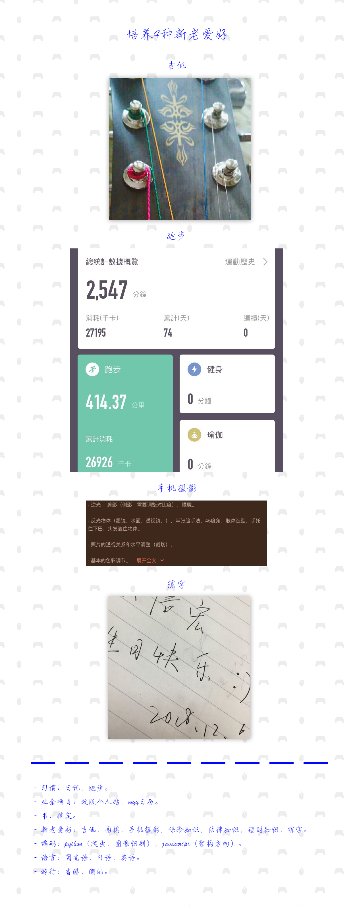

## 大事记

- 习惯：跑步，日记。
- 兴趣：练钢笔，书法（练毛笔），手机摄影，吉他，爬山。
- 旅游：南昌，厦门，广州，深圳，香港，台湾。
- 看书：程序员数学1，3，忽然七日。
- 编码：python，typescript，javascript。
- 蹦迪：香港迪士尼，南昌。
- 语言：日语，英语。

-----

-----

-----

## 19年计划

- 习惯：日记，跑步。
- 业余项目：改版个人站，myy日历。
- 书：待定。
- 新老爱好：吉他，围棋，手机摄影，保险知识，法律知识，理财知识，练字，制作明信片。
- 编码：python（爬虫，图像识别），javascript（架构方向）。
- 语言：闽南语，日语，英语。
- 旅行：香港，潮汕。
